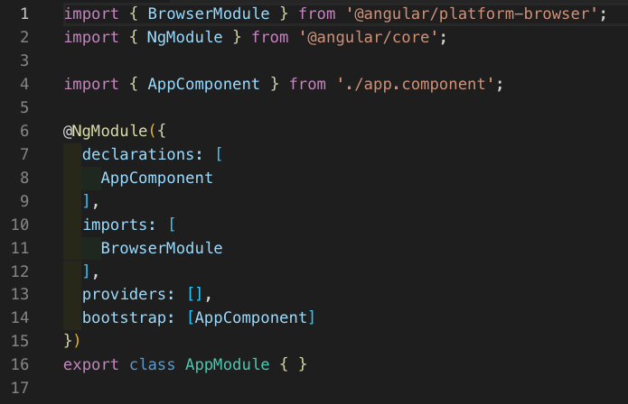

# Angular Day 1

## Things to Note

* It is recommended that you arrange for students to globally install @angular/cli before class today.

* Today's lesson is meant to be an exposure to the way things work in Angular. Point out that it's okay if students keep confusing terms like module and component since it will all come naturally as they get more exposure to the Angular world.

* Students may still feel overwhelmed with TypeScript and ES6. Let them know that *almost*[^footnote] all ES6 is valid TypeScript, the strict typing is only there to help developers. Also, remind them that just like HTML/CSS the syntax will take a while to feel comfortable with. 

[^footnote]: TypeScript vs ES6: Lately, Microsoft has been great at keeping TypeScript close to current ECMAScript support (usually less than a year behind), but this is subject to the user's dedication to constantly update versions. Just let students know that they won't run into issues unless they're trying to use bleeding-edge ES-insert-year-here. View ALL TypeScript changes [here](https://github.com/Microsoft/TypeScript/wiki/What's-new-in-TypeScript).

## Today's Objectives

* Students will feel comfortable creating a project with Angular CLI and generating new components.

* Students will understand the key pieces included in the Angular framework (Modules, Components, and Services) as well as concepts like two-way binding and separation of concerns with components. It's okay if they they don't get directives, pipes, and dependency injection quite yet.

### 1. Instructor do: Go through slides (15 mins)

* Walk through the slideshow [Getting Hooked with Angular](./assets/slideshows/getting_hooked_with_angular2.pptx). Try not to spend more than a minute on each slide, saving conversation about technical topics for later. This slideshow is just meant to introduce things conceptually.

* Don't get hung up on the differences between libraries and frameworks. Keep to the slide and mention that you can't just add frameworks on, halfway through the project. It's an architectural decision.

* The most important point of today's lesson is the concept of components that are responsible for producing pieces of an application's view and functionality. We separate things to make it easier for us to grab just what we need, and reuse it as many times as necessary, all while keeping concerns separate. Everything from blogs on a blog page, to profile pictures, to navigation bars can be separated out into modular, reusable pieces.

* Many students may be annoyed by having to separate things out. Remind them of these three things:
	* Reusability is increasingly important as applications scale.
	* Separating parts into components makes problems *much* easier to deug and makes unit tests possible.
	* Having components makes lazy loading possible, which means smaller file sizes and faster loading, both immensely important to most companies.

* Remember to emphasize that today's class is just day one. Focus your efforts on answering the "whys" and not the "hows". 


### Everyone Do: Installing/Exploring Angular CLI (15 mins)

* Ensure that everyone has run `npm install -g @angular/cli`. *Don't forget the -g!*

* Explain that to generate all the boilerplate code we'll need for an Angular app, we'll use the client by running `ng new` followed by a name for our application.

* Generate a new project
```bash
ng new awesome-project
```
* Have everyone select no routing and CSS when prompted.
```bash
cd awesome-project
ng serve
```
* Note that `npm start` works as well.

* Navigate to [http://localhost:4200](http://localhost:4200) and demonstrate that the app's working.
* Walk through each file generated by the Angular CLI. 
* Briefly touch on the purposes of the `angular.json`, `tslint.json`, and `tsconfig.json` and but try not to get too detailed about any code.
* Make sure to have the students identify the naming convention of the files. How might you name the TypeScript file for a new component?
* Files ending in `*component.spec.*` are created for unit tests. The Angular CLI comes with Jasmine, a standalone testing library for JavaScript. For now, we won't dive into testing, but it's helpful that the Angular CLI is configured to automatically work with this library. 
* The entire `e2e` folder is also built by the Angular CLI for end-to-end testing with Protractor.


* Note that the application is built inside the `<app-root>` element. Show this in the browser as well.


* Next is App module, which is where we include all of the smaller modules, as well as any components (and services) used everywhere throughout our app.



* Up next is the App component. This is our main component, where we will later link to other components from. Make sure to point out the naming convention for components (Camel Case) and hyphens for file names. 


* Lastly, show that the `app.component.html` is just regular HTML, aside from being able to use interpolation to bind our template to our component. Try changing `{{ title }}` to `{{ 2+2 }}` and `{{ title + 2+2 }}` to show that everything within double curly braces can be concatenated and added as well.

* Assure the class that while it all seems very confusing, there isn't a need to completely memorize every aspect of the Angular CLI boilerplate yet. The Angular CLI makes it  The most important takeaways are:

    * We're going to be writing most of our code inside of the `app` folder.

    * The first file to run is the `main.ts` file.

    * Modules bundle up all services, components, and UI involved in a piece of the application. You must include a component in at least one module to make it usable in the application.

    * We start our Angular app in development mode with the command `ng serve`. This way our app will live update as we change it, just like nodemon does for node.js. 


### Instructor Do: Demo ng generate (15 mins)

* Run the following script:
```
ng new hello-angular --skip-tests
```
* Select no routing again and emphasize the skip tests option, since we're not going to deal with testing yet.

* Demonstrate copying the contents of the `app` folder and the `assets` from the repository into the project that we've generated with the CLI.

* Show that most of the code in the activity is very similar to what was in our generated project.

* Point out the different syntax for template binding, and that the main difference is that interpolation allows us to concatenate strings.

* Run the application with `ng serve`.

* Kill the server and type 
```
ng generate component hulk
ng serve
```
* Go back to the tab with the running server and show the application.

* Make sure to point out that HulkComponent is automatically included in `app.module` AND it's CamelCased for components, and hyphenated for file names. But it's still not in our view.

* Also mention the file structure of generated components. Let students know that the CLI has documentation notating different options, like generating the components inline or changing the default `app` prefix.

* Copy and paste the HTML from `iron-man.component.html` into the new component and feel free to use this code for your component: 
```typescript
import { Component, OnInit } from '@angular/core';

@Component({
  selector: 'app-hulk',
  templateUrl: './hulk.component.html',
  styleUrls: ['./hulk.component.css']
})
export class HulkComponent implements OnInit {
  name: string = "Hulk"
  pathToImage: string = "../assets/images/hulk.jpeg"
  constructor() { }

  ngOnInit() {
  }

}
```

* Add the directive `<app-hulk></app-hulk>` to our `app.component.html`


## Student Activity 1 Instructions (15 mins)

## Student Activity 1: Your Own Avengers
* Copy the `app` and `assets` folders from `Unsolved` and put it in place of your class project `app` folder.
* Run it with `ng serve` to make sure it works.
* In your terminal, *generate* two of your own heroes with any name you'd like. Include names, images, and give one of them a secret code name.
* Add some CSS to make the one with a secret codename different in some way.
* Refer to the instructor demo if you get lost.

* **BONUS**: Try to make the secret code name more discrete. If you have some time, try making the codename appear in the console when its respective hero is clicked on. Try Googling "Angular click" to see how you might do this.

* **REMEMBER**: The CLI has **MANY** awesome features that can be explored, but the main goal is to reduce the amount of boilerplate code the user has to write. 
* Bookmark their wiki for later exploration: https://github.com/angular/angular-cli/wiki Here's a link to the *generate* docs: https://github.com/angular/angular-cli/wiki/generate

## Instructor Do: Review Hello World Example (15 mins)

* Slack out the Solved version of the activity and go over the solution with the class.

* Point out how you can use interpolation for strings, and brackets for property binding.

* Demonstrate how we can alternatively write all of our component's code inside of `app.component.ts` Inform them that this would defeat the purpose of components and render that code impossible to reuse.

* Point out that for TypeScript:

  * All valid JavaScript is valid TypeScript, with the exception of bleeding-edge syntax.

  * Just like with ES6, we use `import` statements instead of using `require`.

  * If you define a variable in the same line you declare it, TypeScript will automatically infer its type.

  * Even if you don't define the variable or its type, it will default to type: `Any`. 

* Spend a few moments taking suggestions from the class on how you could improve your little app. Address whether or not Angular will allow them to do it. (Normally Angular will be involved in some way)

* This could be a good time to mention again that Angular and AngularJS are vastly different, and it could help to specify Angular2 when using Google-Fu.

## End of class

* Congratulate everyone for making it through the first day of Angular.
* Encourage students to look over their activities and complete the tutorial on [Angular's docs](https://angular.io/tutorial) to solidify their understanding.
* Make sure to slack out links to [IOC](https://en.wikipedia.org/wiki/Inversion_of_control) and [frameworks vs libraries](http://www.differencebetween.net/technology/difference-between-library-and-framework/). Tell them that those links cover the topics at a higher level of abstraction.

* Here's a link to some cool open-source Angular projects: [https://angularexpo.com/](https://angularexpo.com/)


# More...
* I would expect that the remaining hours would cover `*ngFor`, routing, and hopefully services.
